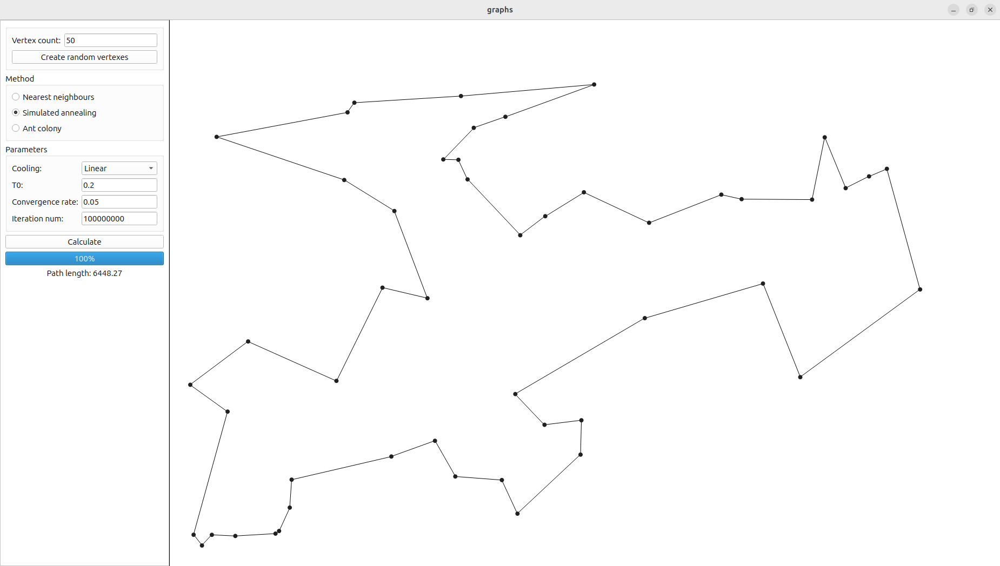

#Graphs

This program generates a specified number of dots and lets you find near-optimal commi-voyager path between them with various algorithms. There is also a possibility to adjust algorithm parameters to get a better result.

Example:

